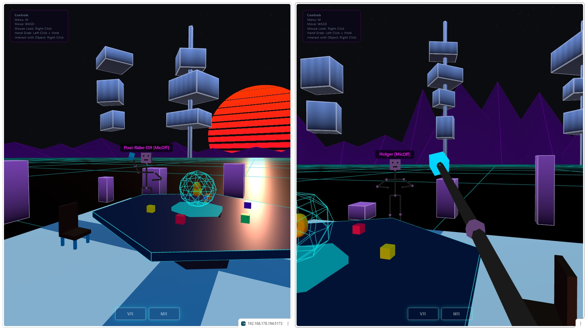
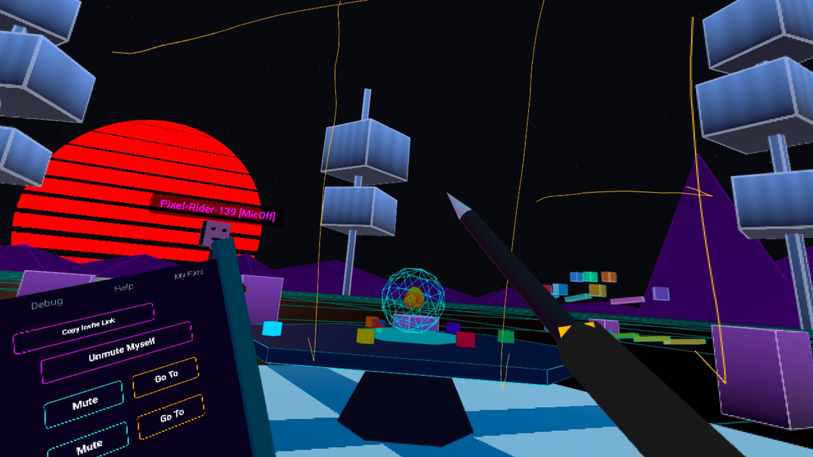
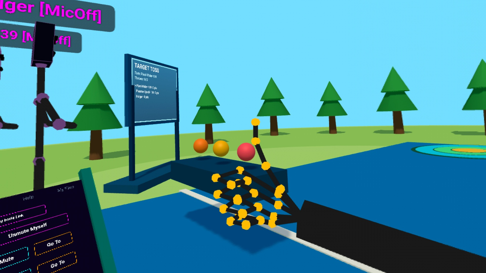
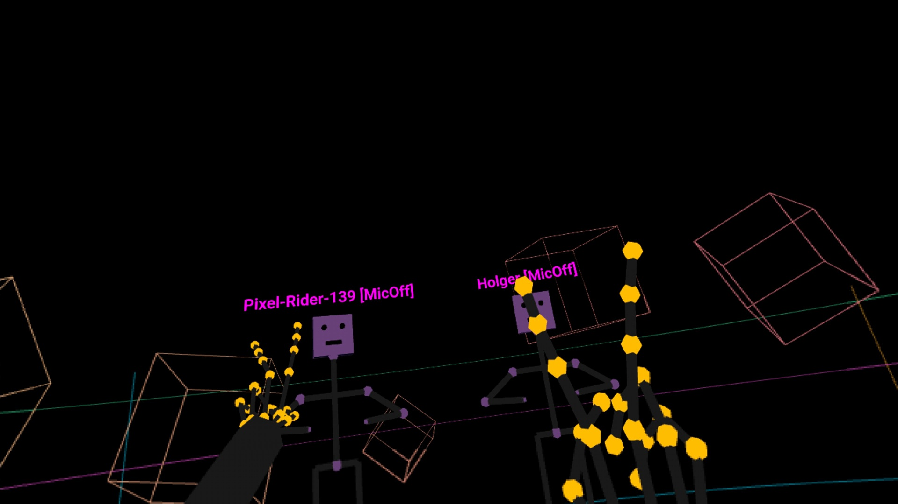
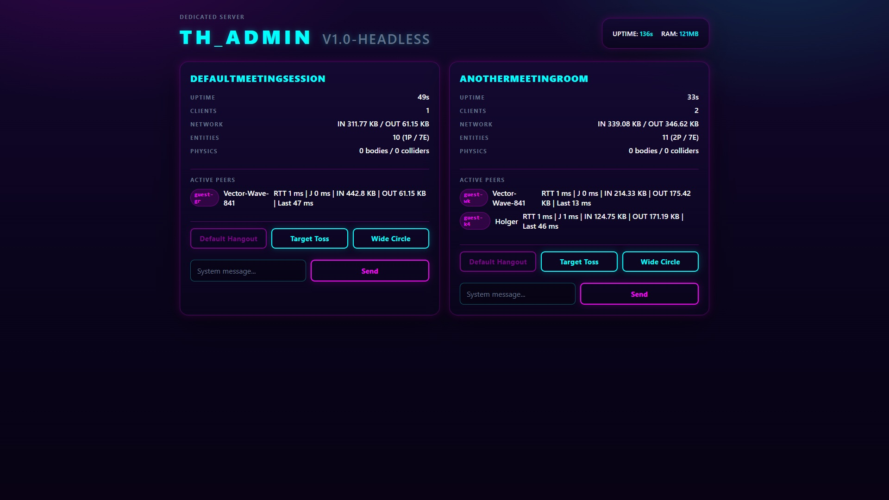
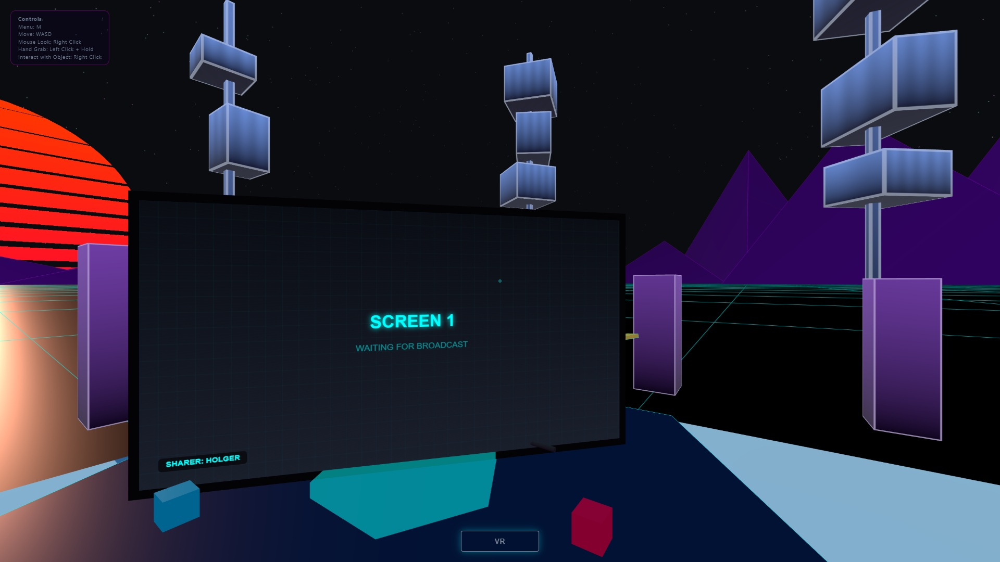
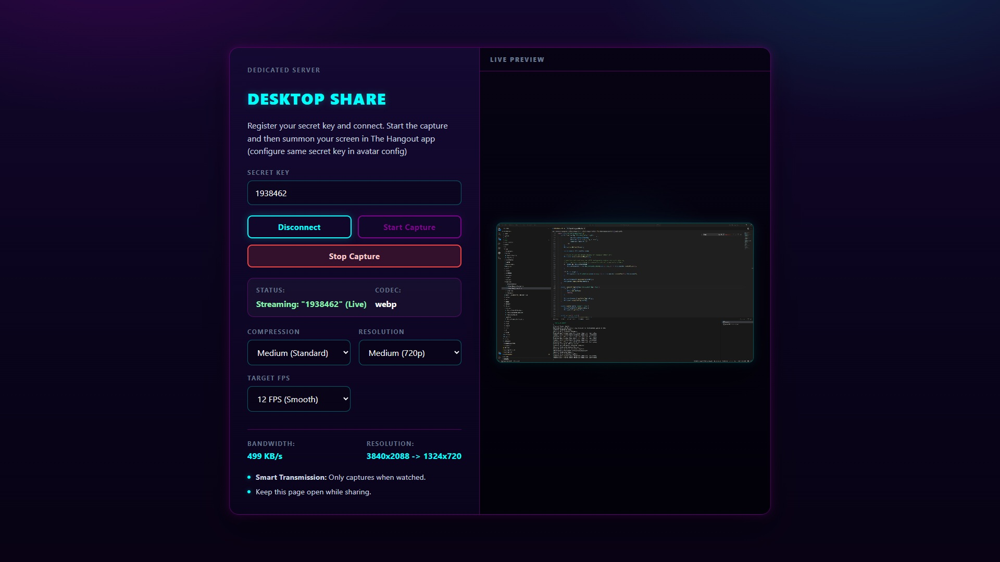
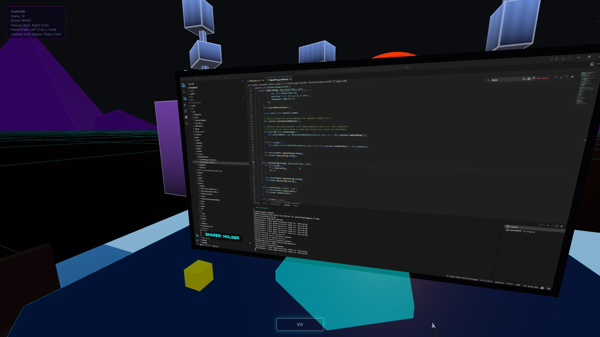

# The Hangout

A playful space for small groups of people to hang out. 

Try it here: [https://neospark314.github.io/TheHangout/](https://neospark314.github.io/TheHangout/)

| | |
|---|---|
|  |  |
|  |  |

## Main objectives
- No setup, no accounts, quick to join
- Fun
- VR first design but usable from Desktop (Mouse/Keyboard or Controller) and Mobile (Touch controls)
- Simple static version hostable on any static web server with PeerJS for signaling (no backend required)
- Dedicated Server version for hosting on internal networks (works without internet connection or in more secure environments)

## Status

Alpha playground: just for fun, exploration, and rapid iteration rather than stability, so APIs, features, and project direction may change any time.

## Quick Start

### Development

```bash
npm install
npm run dev          # Development (Vite + PeerJS)
```

### Static site (no backend required)
Build it and drop the `dist/` folder onto any static web page host. The first person to join acts as the host via PeerJS.
```bash
npm run build        # Build the client
```

### Dedicated Server
Best for internal/offline networks or more "secure" hangouts. It uses a local WebSocket.

| | |
|---|---|
|  |  |
|  |  |

Default starts on port 443 (uses your `--cert/--key` if provided, otherwise falls back to `@vitejs/plugin-basic-ssl` certificate generation); no PeerJS used (local WebSocket relay used instead)

```bash
npm run build        # Build the client
npm run serve        # Start
```

**Desktop Sharing Page** (`/share`)

When running the local server, open this URL on the desktop machine you want to stream:

```bash
https://<server-address>/share
```

Steps:
- Choose and enter a secret share key (for example `MyDesktopPC123`)
- Click **Connect** and then **Share**
- Keep the page open (it will start/stop capture when summoned from VR Session tab)
- Before entering a hangout session configure your screen in the avatar customization section

## Technology Stack

The Hangout is built on top of a small set of open source libraries:

- [Three.js](https://threejs.org/) for rendering and WebXR integration
- [three-vrm](https://github.com/pixiv/three-vrm) for VRM avatar loading and humanoid posing
- [Rapier](https://rapier.rs/) via [`@dimforge/rapier3d-compat`](https://www.npmjs.com/package/@dimforge/rapier3d-compat) for physics
- [PeerJS](https://peerjs.com/) and [peer](https://github.com/peers/peerjs-server) for browser-to-browser signaling and networking
- [Vite](https://vitejs.dev/) for development and production builds
- [Vitest](https://vitest.dev/) for testing
- [Express](https://expressjs.com/) and [ws](https://github.com/websockets/ws) for the dedicated server and WebSocket transport

## Coverage Strategy

Coverage is used here as an architectural signal, not as a target by itself.

- Prioritize deterministic runtime coordination, authority rules, lifecycle boundaries, and replication behavior.
- Prefer integration-style runtime tests at clear seams over mocking every internal method.
- Avoid brittle coverage-driven tests for rendering internals, WebXR helpers, cosmetic effects, or DOM styling unless they protect a real regression.
- Keep renderer-heavy and browser-heavy paths under lighter coverage until feature work or bugs justify deeper tests.

Use the engine-focused report when you want a current baseline for core runtime code:

```bash
npm run test:coverage
```

The HTML report is written to `coverage/engine/index.html`.

## Credits & Assets

- **[Quaternius](https://quaternius.com/)**: For the amazing [Stylized Nature Mega Kit](https://quaternius.com/packs/stylizednaturemegakit.html).
- **[gltfpack](https://meshoptimizer.org/gltf/)**: All 3D assets are optimized using the `gltfpack` tool from the Meshoptimizer project for efficient web delivery.

## License

This project is licensed under the [MIT License](LICENSE).
